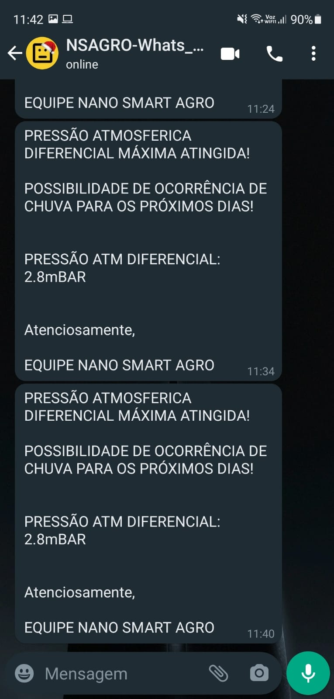
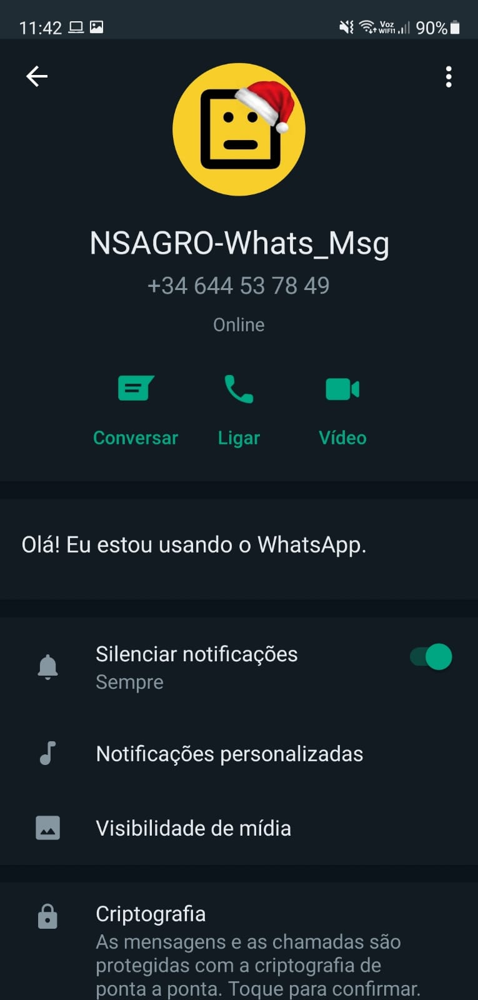
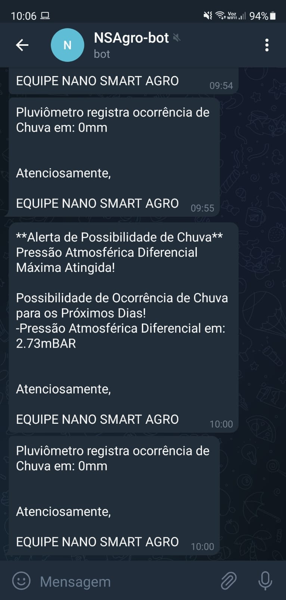
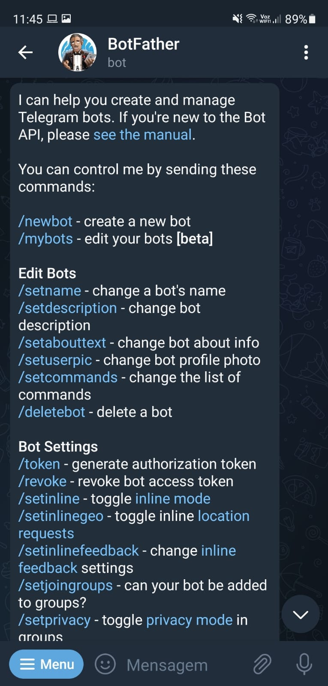
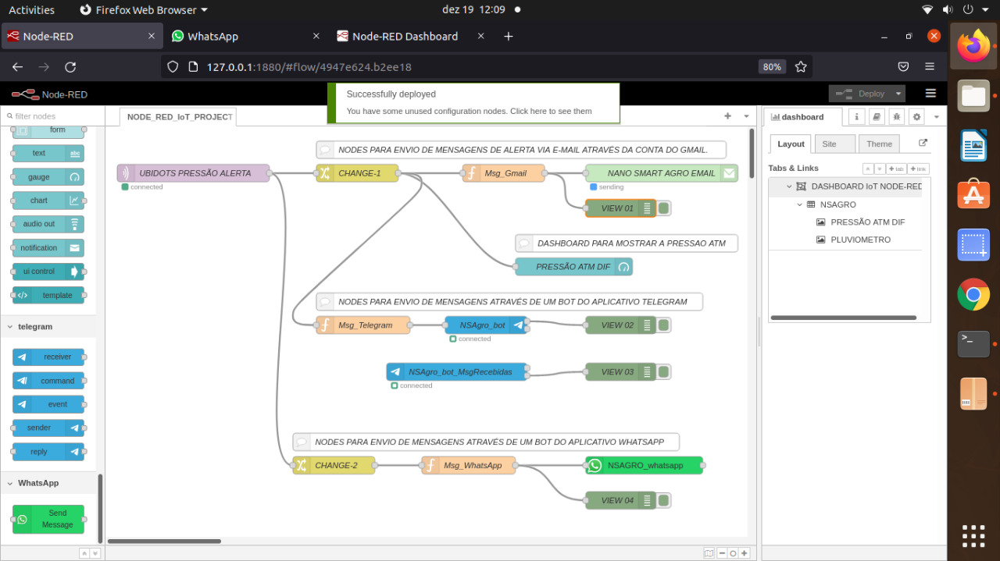
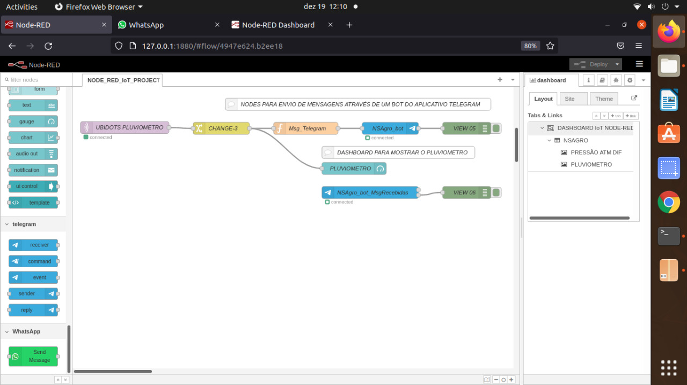
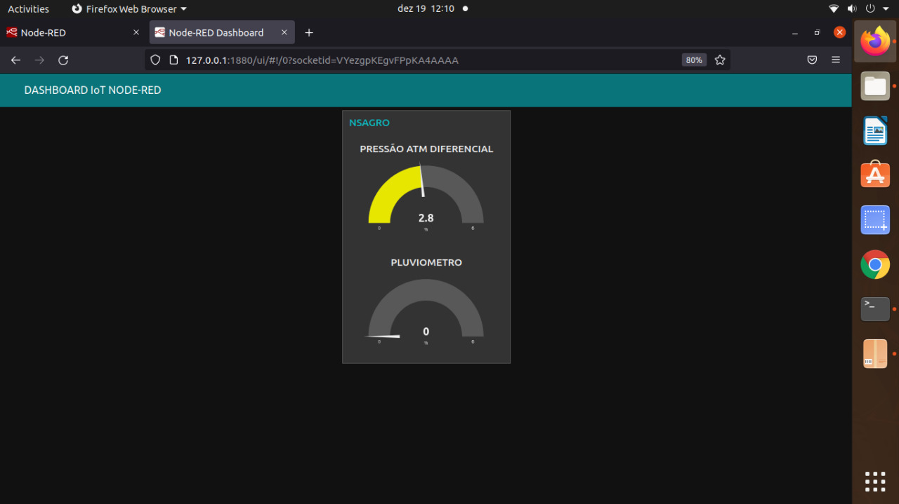

# Projeto_IoT_com_WhatsAPP_Telegram_e_Gmail

Projeto IoT que envia dados ao Server Ubidots e com a utilização da ferramenta Node-RED, permite a possibilidade de enviar mensagens através dos aplicativos: WhatsApp, TELEGRAM e envio de alerta de e-mail através do Gmail.

## - Objetivo

Permitir que dados enviados ao Server Ubidots, possam ser retransmitidos por meio de mensagens através dos aplicativos: WhatsApp, TELEGRAM e envio de alerta de e-mail através do Gmail.

## - Projeto IoT

Para a integração dos Dados enviados ao Server Ubidots, foi utilizado o Projeto IoT responsável pelo monitoramento remoto de variáveis em um vinhedo localizado na cidade de Piedade-SP.: 

[Link](https://github.com/walter-retzer/Projeto_IoT)

## - Mensagens Recebidas

### Mensagens Recebidas pelo WhatsApp: 

### Mensagens Recebidas pelo Telegram: 

### Mensagens Recebidas pelo Gmail: 

## - Flows Implementados no Node-RED

### Flow para envio de Dados de Alerta de Pressão Atmosférica: 

### Flow para envio de Dados do Pluviômetro: 

### Dashboard do Node-RED para exibir os Dados de Alerta de Pressão Atmosférica e Pluviômetro: 

## - Node-RED

O Node-RED é uma ferramenta de desenvolvimento baseada em fluxo para programação visual desenvolvida originalmente pela IBM para conectar dispositivos de hardware, APIs e serviços online como parte da Internet das Coisas.

[Link](https://nodered.org/)

O Node-RED permite a criação de funcionalidade ao conectar fluxos de dados entre nós utilizando um navegador. E ganhou enorme popularidade no espaço da IoT, modelando bits de funcionalidade de aplicativos entre dispositivos de IoT, como sensores, câmeras e roteadores sem fio.

Confira o Node-RED Starter na IBM Cloud, isso guiará o seu caminho rumo à criação de grandes funcionalidades!  

[Link](https://developer.ibm.com/tutorials/how-to-create-a-node-red-starter-application/)

## - Pallete Utilizada no Node-RED para Envio de Mensagens pelo WhatsApp:

[Link](https://flows.nodered.org/node/node-red-contrib-whatsapp-cmb)

[Link](https://www.callmebot.com/blog/free-api-whatsapp-messages/)

[Link](https://core.telegram.org/bots/api)

## - Pallete Utilizada no Node-RED para Envio de Mensagens pelo Telegram:

[Link](https://flows.nodered.org/node/node-red-contrib-telegrambot)

## - Pallete Utilizada no Node-RED para Envio de Email pelo Gmail:

[Link](https://flows.nodered.org/node/node-red-node-email)

